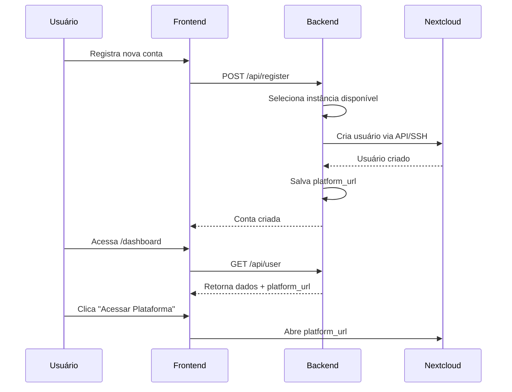

# URL da Plataforma por Usuário

## Visão Geral

Cada usuário do SaaS LibreSign é criado em uma instância específica do Nextcloud. A URL dessa instância é armazenada no campo `platform_url` do usuário e é usada para direcionar o acesso à plataforma.

## Como Funciona

### 1. Criação do Usuário

Quando um novo usuário se registra:

1. O sistema seleciona uma instância Nextcloud disponível (com menor número de usuários)
2. Cria o usuário nessa instância via API/SSH
3. Armazena a URL da instância no campo `platform_url` do usuário

```php
// app/Jobs/CreateNextcloudUser.php
$this->user->update([
    'nextcloud_instance_id' => $instance->id,
    'platform_url' => $instance->url, // Ex: https://cloud1.libresign.coop
]);
```

### 2. Acesso à Plataforma

No dashboard do usuário (`/dashboard`):

- O botão "Acessar Plataforma" usa o `platform_url` específico do usuário
- Se a URL ainda não estiver disponível (conta em criação), exibe mensagem de aguarde
- Quando disponível, abre a URL da instância correta em nova aba

```typescript
// frontend/app/dashboard/page.tsx
const handleAccessPlatform = () => {
  if (!user?.platform_url) {
    setToast({ 
      message: "Sua conta ainda está sendo configurada...", 
      type: "warning" 
    });
    return;
  }
  
  window.open(user.platform_url, "_blank");
};
```

## Estrutura do Banco de Dados

### Tabela: `users`

```sql
ALTER TABLE users ADD COLUMN platform_url VARCHAR(255) NULL;
```

**Campo:** `platform_url`
- **Tipo:** string (nullable)
- **Descrição:** URL da instância Nextcloud onde o usuário foi criado
- **Exemplo:** `https://cloud1.libresign.coop`

## Cenários de Uso

### Cenário 1: Múltiplas Instâncias Regionais

```
Instância 1: https://cloud-br.libresign.coop (Brasil)
Instância 2: https://cloud-us.libresign.coop (EUA)
Instância 3: https://cloud-eu.libresign.coop (Europa)
```

Usuários são direcionados para instância mais próxima ou com menor carga.

### Cenário 2: Clientes Enterprise

Grandes clientes podem ter instância dedicada:

```
Cliente XYZ Corp: https://xyz.libresign.coop
Cliente ABC Inc: https://abc.libresign.coop
```

### Cenário 3: Ambientes de Teste

```
Produção: https://cloud.libresign.coop
Homologação: https://staging.libresign.coop
Desenvolvimento: https://dev.libresign.coop
```

## API Endpoints

### Obter Dados do Usuário

```
GET /api/user
```

**Resposta:**
```json
{
  "id": 123,
  "name": "João Silva",
  "email": "joao@example.com",
  "platform_url": "https://cloud1.libresign.coop",
  ...
}
```

### Atualizar URL da Plataforma (Admin)

Se for necessário migrar um usuário para outra instância:

```php
$user = User::find($userId);
$user->update([
    'platform_url' => 'https://cloud2.libresign.coop',
    'nextcloud_instance_id' => $newInstance->id,
]);
```

## Fluxo Completo



## Estados do Campo `platform_url`

### NULL
- **Quando:** Usuário acabou de ser criado
- **Status:** `nextcloud_status = 'pending'` ou `'creating'`
- **Ação:** Mostrar mensagem "Conta sendo configurada..."

### URL Válida
- **Quando:** Usuário foi criado com sucesso no Nextcloud
- **Status:** `nextcloud_status = 'active'`
- **Ação:** Permitir acesso à plataforma

### Verificação no Frontend

```typescript
if (!user?.platform_url) {
  // Conta ainda não configurada
  return (
    <div className="alert warning">
      Sua conta está sendo configurada. 
      Aguarde alguns instantes e atualize a página.
    </div>
  );
}

// Conta configurada - mostrar botão
<button onClick={() => window.open(user.platform_url, '_blank')}>
  Acessar Plataforma
</button>
```

## Migração de Usuários

Se precisar migrar usuários entre instâncias:

```php
use App\Services\NextcloudService;

function migrateUserToInstance(User $user, NextcloudInstance $newInstance)
{
    $oldInstance = $user->nextcloudInstance;
    
    // 1. Criar usuário na nova instância
    $nc = new NextcloudService($newInstance);
    $nc->createUser($user->nextcloud_user_id, $user->name, $user->email, $newPassword);
    
    // 2. Migrar dados (via WebDAV ou rsync)
    // ... código de migração de arquivos ...
    
    // 3. Atualizar registro do usuário
    $user->update([
        'platform_url' => $newInstance->url,
        'nextcloud_instance_id' => $newInstance->id,
    ]);
    
    // 4. Remover usuário da instância antiga (opcional)
    $oldNc = new NextcloudService($oldInstance);
    $oldNc->deleteUser($user->nextcloud_user_id);
    
    return true;
}
```

## Troubleshooting

### Problema: URL é NULL após criação

**Causa:** Job de criação falhou ou ainda está rodando

**Solução:**
```bash
# Verificar status do usuário
php artisan tinker
>>> User::find(123)->nextcloud_status
=> "failed"

# Tentar recriar
>>> dispatch(new \App\Jobs\CreateNextcloudUser($user))
```

### Problema: URL aponta para instância errada

**Causa:** Migração não completada ou erro manual

**Solução:**
```php
// Corrigir URL manualmente
$user->update([
    'platform_url' => 'https://cloud-correct.libresign.coop'
]);
```

### Problema: Usuário não consegue acessar URL

**Possíveis causas:**
1. Instância está offline
2. Usuário foi deletado no Nextcloud
3. Problema de DNS/certificado

**Verificação:**
```bash
# Testar conectividade
curl -I https://cloud1.libresign.coop

# Verificar se usuário existe no Nextcloud
ssh user@server "docker exec nextcloud occ user:info user_id"
```

## Melhores Práticas

1. **Sempre validar URL antes de salvar:**
   ```php
   if (!filter_var($url, FILTER_VALIDATE_URL)) {
       throw new \Exception('URL inválida');
   }
   ```

2. **Incluir protocolo (https://):**
   ```php
   $url = 'https://cloud.example.com'; // ✓ Correto
   $url = 'cloud.example.com';         // ✗ Incompleto
   ```

3. **Remover trailing slash:**
   ```php
   $url = rtrim($instance->url, '/');
   ```

4. **Monitorar instâncias:**
   - Criar dashboard com status de cada instância
   - Alertar quando instância está próxima da capacidade
   - Health check automático das URLs

## Segurança

- **Não permitir** que usuários alterem sua própria `platform_url`
- Apenas admins devem poder atualizar este campo
- Validar que a URL aponta para domínio confiável:
  ```php
  $allowedDomains = ['libresign.coop'];
  $host = parse_url($url, PHP_URL_HOST);
  if (!Str::endsWith($host, $allowedDomains)) {
      throw new \Exception('Domínio não autorizado');
  }
  ```

## Monitoramento

Criar métricas para acompanhar:

- Distribuição de usuários por instância
- Taxa de falha na criação (URLs NULL)
- Tempo médio até URL estar disponível
- Instâncias com melhor performance

```sql
-- Usuários por instância
SELECT 
    platform_url,
    COUNT(*) as total_users
FROM users
WHERE platform_url IS NOT NULL
GROUP BY platform_url;

-- Usuários sem URL (aguardando criação)
SELECT COUNT(*) FROM users WHERE platform_url IS NULL;
```
