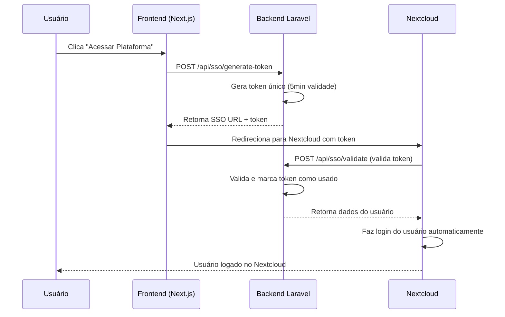

# Implementação de Single Sign-On (SSO)

## Visão Geral

Este documento descreve a implementação de SSO entre o SaaS LibreSign e as instâncias do Nextcloud, permitindo que usuários acessem sua plataforma Nextcloud sem precisar fazer login novamente.

## Arquitetura

### Fluxo do SSO



## Componentes Implementados

### 1. Banco de Dados

**Tabela:** `login_tokens`

| Campo | Tipo | Descrição |
|-------|------|-----------|
| id | bigint | ID único |
| user_id | bigint | FK para users |
| token | string(64) | Token único gerado |
| expires_at | timestamp | Expiração (padrão: 5 minutos) |
| used | boolean | Se o token foi usado |
| used_at | timestamp | Quando foi usado |
| ip_address | string(45) | IP do cliente |
| user_agent | text | User agent do navegador |

### 2. Model: LoginToken

**Localização:** `app/Models/LoginToken.php`

**Métodos principais:**

- `generateFor(User $user, int $expiresInMinutes = 5)` - Gera novo token
- `validateAndUse(string $token)` - Valida e marca token como usado
- `isValid()` - Verifica se token é válido
- `cleanupExpired()` - Limpa tokens expirados

### 3. Controller: SSOController

**Localização:** `app/Http/Controllers/Api/SSOController.php`

**Endpoints:**

#### POST `/api/sso/generate-token` (Autenticado)

Gera um token SSO para o usuário atual.

**Headers:**
```
Authorization: Bearer {token}
```

**Resposta (sucesso):**
```json
{
  "success": true,
  "sso_url": "https://cloud.libresign.coop/index.php/apps/libresign_sso/login?token=abc123...",
  "expires_at": "2025-11-08T17:35:00.000Z"
}
```

#### POST `/api/sso/validate` (Público)

Valida um token SSO. Este endpoint é chamado pelo Nextcloud.

**Body:**
```json
{
  "token": "abc123..."
}
```

**Resposta (sucesso):**
```json
{
  "success": true,
  "user": {
    "id": 123,
    "email": "user@example.com",
    "name": "João Silva",
    "nextcloud_user_id": "joaosilva_abc123"
  }
}
```

## Implementação no Nextcloud

Para completar a integração SSO, você precisa criar um app customizado no Nextcloud ou usar um script PHP.

### Opção 1: App Nextcloud (Recomendado)

Crie um app chamado `libresign_sso` no Nextcloud:

**Estrutura:**
```
apps/libresign_sso/
├── appinfo/
│   ├── info.xml
│   └── routes.php
├── lib/
│   └── Controller/
│       └── LoginController.php
└── templates/
    └── error.php
```

**routes.php:**
```php
<?php
return [
    'routes' => [
        ['name' => 'login#ssoLogin', 'url' => '/login', 'verb' => 'GET'],
    ]
];
```

**LoginController.php:**
```php
<?php
namespace OCA\LibresignSSO\Controller;

use OCP\AppFramework\Controller;
use OCP\AppFramework\Http\RedirectResponse;
use OCP\IRequest;
use OCP\IUserSession;
use OCP\IUserManager;
use OCP\ILogger;

class LoginController extends Controller
{
    private $userSession;
    private $userManager;
    private $logger;
    private $ssoApiUrl;

    public function __construct(
        $appName,
        IRequest $request,
        IUserSession $userSession,
        IUserManager $userManager,
        ILogger $logger
    ) {
        parent::__construct($appName, $request);
        $this->userSession = $userSession;
        $this->userManager = $userManager;
        $this->logger = $logger;
        
        // URL da API do SaaS
        $this->ssoApiUrl = getenv('SAAS_API_URL') ?: 'https://saas.libresign.coop/api';
    }

    /**
     * @NoAdminRequired
     * @NoCSRFRequired
     * @PublicPage
     */
    public function ssoLogin($token)
    {
        if (empty($token)) {
            $this->logger->warning('SSO: Token not provided');
            return new RedirectResponse('/login?sso_error=invalid_token');
        }

        // Validar token com o SaaS
        $ch = curl_init($this->ssoApiUrl . '/sso/validate');
        curl_setopt_array($ch, [
            CURLOPT_RETURNTRANSFER => true,
            CURLOPT_POST => true,
            CURLOPT_POSTFIELDS => json_encode(['token' => $token]),
            CURLOPT_HTTPHEADER => ['Content-Type: application/json'],
            CURLOPT_TIMEOUT => 10,
        ]);

        $response = curl_exec($ch);
        $httpCode = curl_getinfo($ch, CURLINFO_HTTP_CODE);
        curl_close($ch);

        if ($httpCode !== 200) {
            $this->logger->error('SSO: Token validation failed', [
                'http_code' => $httpCode,
                'response' => $response
            ]);
            return new RedirectResponse('/login?sso_error=validation_failed');
        }

        $data = json_decode($response, true);

        if (!$data || !$data['success']) {
            $this->logger->error('SSO: Invalid response from SaaS API');
            return new RedirectResponse('/login?sso_error=invalid_response');
        }

        $nextcloudUserId = $data['user']['nextcloud_user_id'];
        $user = $this->userManager->get($nextcloudUserId);

        if (!$user) {
            $this->logger->error('SSO: User not found in Nextcloud', [
                'nextcloud_user_id' => $nextcloudUserId
            ]);
            return new RedirectResponse('/login?sso_error=user_not_found');
        }

        // Fazer login do usuário
        $this->userSession->login($nextcloudUserId, '');
        $this->userSession->createSessionToken($this->request, $user->getUID(), $nextcloudUserId);

        $this->logger->info('SSO: User logged in successfully', [
            'user_id' => $nextcloudUserId,
            'email' => $data['user']['email']
        ]);

        // Redirecionar para a home do Nextcloud
        return new RedirectResponse('/');
    }
}
```

### Opção 2: Script PHP Simplificado

Se não quiser criar um app completo, coloque este script em:
`/var/www/html/sso_login.php`

```php
<?php
// sso_login.php - Simple SSO endpoint for Nextcloud

require_once __DIR__ . '/lib/base.php';

$token = $_GET['token'] ?? '';

if (empty($token)) {
    header('Location: /login?sso_error=invalid_token');
    exit;
}

// Validar token com API do SaaS
$apiUrl = getenv('SAAS_API_URL') ?: 'https://saas.libresign.coop/api';
$ch = curl_init($apiUrl . '/sso/validate');
curl_setopt_array($ch, [
    CURLOPT_RETURNTRANSFER => true,
    CURLOPT_POST => true,
    CURLOPT_POSTFIELDS => json_encode(['token' => $token]),
    CURLOPT_HTTPHEADER => ['Content-Type: application/json'],
]);

$response = curl_exec($ch);
$httpCode = curl_getinfo($ch, CURLINFO_HTTP_CODE);
curl_close($ch);

if ($httpCode !== 200) {
    header('Location: /login?sso_error=validation_failed');
    exit;
}

$data = json_decode($response, true);

if (!$data || !$data['success']) {
    header('Location: /login?sso_error=invalid_response');
    exit;
}

// Fazer login via OCC
$userId = $data['user']['nextcloud_user_id'];
$userSession = \OC::$server->getUserSession();
$userManager = \OC::$server->getUserManager();

$user = $userManager->get($userId);
if (!$user) {
    header('Location: /login?sso_error=user_not_found');
    exit;
}

$userSession->login($userId, '');
$userSession->createSessionToken(\OC::$server->getRequest(), $user->getUID(), $userId);

// Redirecionar para home
header('Location: /');
exit;
```

## Atualização do Frontend

Modifique o botão "Acessar Plataforma" para usar SSO:

```typescript
// frontend/app/dashboard/page.tsx
const handleAccessPlatform = async () => {
  if (!user?.platform_url) {
    setToast({ 
      message: "Sua conta ainda está sendo configurada...", 
      type: "warning" 
    });
    return;
  }

  try {
    // Gerar token SSO
    const response = await api.post('/sso/generate-token');
    
    if (response.data.success) {
      // Redirecionar para URL com token
      window.open(response.data.sso_url, '_blank');
    }
  } catch (error: any) {
    setToast({
      message: error.response?.data?.message || "Erro ao gerar acesso SSO",
      type: "error"
    });
  }
};
```

## Segurança

### Medidas Implementadas

1. **Tokens de Uso Único:** Cada token só pode ser usado uma vez
2. **Expiração Rápida:** Tokens expiram em 5 minutos
3. **Invalidação Automática:** Tokens anteriores são invalidados ao gerar novo
4. **Logging:** Todas as tentativas são registradas
5. **Rate Limiting:** Considere adicionar rate limit nos endpoints

### Configuração Adicional Recomendada

**No Laravel (.env):**
```env
# URLs permitidas para CORS (Nextcloud instances)
SANCTUM_STATEFUL_DOMAINS=cloud.libresign.coop,cloud1.libresign.coop
```

**No Nextcloud:**
```bash
# Definir URL da API do SaaS
occ config:system:set saas_api_url --value="https://saas.libresign.coop/api"
```

## Manutenção

### Limpeza Automática de Tokens Expirados

Adicione ao scheduler (`routes/console.php`):

```php
Schedule::call(function () {
    LoginToken::cleanupExpired();
})->daily();
```

### Monitoramento

Monitore os logs para:
- Tokens inválidos frequentes (possível ataque)
- Tokens expirados (usuários com experiência ruim)
- Falhas de validação (problemas de integração)

```bash
# Ver logs de SSO
tail -f storage/logs/laravel.log | grep "SSO:"
```

## Troubleshooting

### Erro: "Token inválido ou expirado"

**Causas:**
- Token já foi usado
- Token expirou (>5 minutos)
- Token não existe

**Solução:** Gerar novo token clicando novamente em "Acessar Plataforma"

### Erro: "User not found in Nextcloud"

**Causas:**
- Usuário ainda não foi criado no Nextcloud
- nextcloud_user_id está incorreto

**Solução:**
```bash
# Verificar se usuário existe
php artisan tinker
>>> $user = User::find(123);
>>> $user->nextcloud_status;
=> "active"  # Deve estar "active"
```

### Erro de CORS

**Causa:** Nextcloud não está autorizado a chamar a API

**Solução:** Adicionar domínio do Nextcloud no `config/cors.php`:
```php
'allowed_origins' => [
    'https://cloud.libresign.coop',
    'https://cloud1.libresign.coop',
],
```

## Próximos Passos

1. ✅ Backend SSO implementado
2. ⏳ Criar app Nextcloud para SSO
3. ⏳ Atualizar frontend para usar SSO
4. ⏳ Testar em ambiente de desenvolvimento
5. ⏳ Configurar HTTPS em produção
6. ⏳ Adicionar rate limiting
7. ⏳ Documentar para time de DevOps

## Referências

- [Nextcloud App Development](https://docs.nextcloud.com/server/latest/developer_manual/)
- [Laravel Sanctum](https://laravel.com/docs/sanctum)
- [SSO Best Practices](https://cheatsheetseries.owasp.org/cheatsheets/Single_Sign_On_Cheat_Sheet.html)
